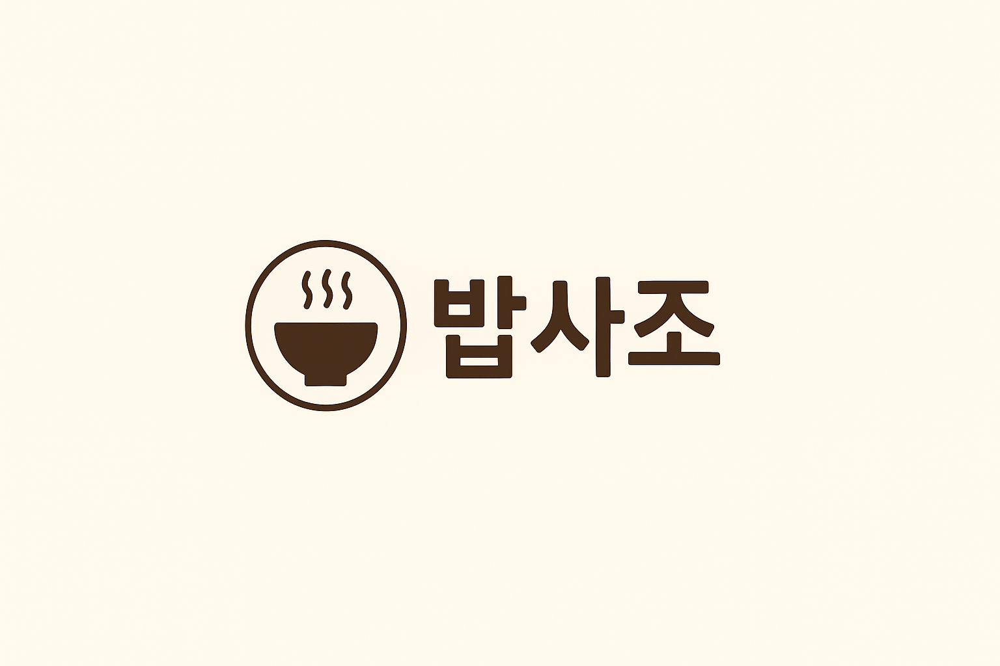

# 🛵 같이먹자 프로젝트 🛵

---

- 혼자 배달 음식을 시켜 먹다 보면 메뉴 선택도 어렵고 배달비도 부담되기 쉽습니다.
  같이먹자는 이러한 문제를 해결하기 위해, **배달을 ‘함께’로 바꾸는 플랫폼**입니다.

  <p align="center">
  
  </p>
  <p align="center">
  
  </p>

## 📌 주요 기능

- 메뉴를 공유 장바구니에 담아 함께 주문
- 실시간 채팅으로 주변 사람과 메뉴와 배달 조율

## 💡 핵심 가치 및 차별점

- 혼자서 배달 시 발생하는 부담 최소화
- 실시간 커뮤니케이션으로 함께 주문 효율 극대화
- 배달을 혼자가 아닌 여럿이서 더 편리하고 즐겁게 즐길 수 있도록 설계

## 🏗️ 프로젝트 구조

<details>
<summary>클릭하여 프로젝트 파일 구조를 확인하세요.</summary>

📦 project-root/   
┣ 📂 data/   
┣ 📂 gradle/  
┣ 📂 grafana/  
┣ 📂 grafana_data/  
┣ 📂 logs/  
┣ 📂 mysql_exporter/  
┣ 📂 prometheus/  
┣ 📂 src/  
┃ ┣ 📂 main/  
┃ ┃ ┣ 📂 java/  
┃ ┃ ┃ ┗ 📂 com/  
┃ ┃ ┃ ┃ ┗ 📂 example/  
┃ ┃ ┃ ┃ ┃ ┗ 📂 eat_together/  
┃ ┃ ┃ ┃ ┃ ┃ ┣ 📂 domain/  
┃ ┃ ┃ ┃ ┃ ┃ ┃ ┣ 📂 cart/  
┃ ┃ ┃ ┃ ┃ ┃ ┃ ┃ ┣ 📂 controller/  
┃ ┃ ┃ ┃ ┃ ┃ ┃ ┃ ┣ 📂 dto/  
┃ ┃ ┃ ┃ ┃ ┃ ┃ ┃ ┣ 📂 entity/  
┃ ┃ ┃ ┃ ┃ ┃ ┃ ┃ ┣ 📂 repository/  
┃ ┃ ┃ ┃ ┃ ┃ ┃ ┃ ┗ 📂 service/  
┃ ┃ ┃ ┃ ┃ ┃ ┃ ┣ 📂 chat/  
┃ ┃ ┃ ┃ ┃ ┃ ┃ ┣ 📂 menu/  
┃ ┃ ┃ ┃ ┃ ┃ ┃ ┣ 📂 notification/  
┃ ┃ ┃ ┃ ┃ ┃ ┃ ┣ 📂 order/  
┃ ┃ ┃ ┃ ┃ ┃ ┃ ┣ 📂 payment/  
┃ ┃ ┃ ┃ ┃ ┃ ┃ ┣ 📂 rider/  
┃ ┃ ┃ ┃ ┃ ┃ ┃ ┣ 📂 social/  
┃ ┃ ┃ ┃ ┃ ┃ ┃ ┗ 📂 store/  
┃ ┃ ┃ ┃ ┃ ┃ ┃ ┗ 📂 users/  
┃ ┃ ┃ ┃ ┃ ┃ ┣ 📂 global/  
┃ ┃ ┃ ┃ ┃ ┃ ┃ ┣ 📂 common/  
┃ ┃ ┃ ┃ ┃ ┃ ┃ ┣ 📂 config/  
┃ ┃ ┃ ┃ ┃ ┃ ┃ ┣ 📂 dto/  
┃ ┃ ┃ ┃ ┃ ┃ ┃ ┣ 📂 entity/  
┃ ┃ ┃ ┃ ┃ ┃ ┃ ┣ 📂 exception/  
┃ ┃ ┃ ┃ ┃ ┃ ┃ ┣ 📂 redis/  
┃ ┃ ┃ ┃ ┃ ┃ ┃ ┣ 📂 util/  
┃ ┃ ┃ ┃ ┃ ┃ ┃ ┗ 📂 websocket/  
┃ ┃ ┃ ┃ ┃ ┃ ┗ 📜 EatTogetherApplication.java  
┃ ┃ ┗ 📂 resources/  
┃ ┃ ┃ ┣ 📂 static/  
┃ ┃ ┃ ┗ 📜 application.yml  
┃ ┣ 📂 test/  
┃ ┗ 📜 .env  
┣ 📜 .gitattributes  
┣ 📜 .gitignore  
┣ 📜 build.gradle  
┣ 📜 docker-compose.yml  
┣ 📜 Dockerfile  
┣ 📜 Dockerfile.elasticsearch  
┣ 📜 gradlew  
┣ 📜 gradlew.bat  
┣ 📜 README.md  
┣ 📜 settings.gradle  
┗ 📂 외부 라이브러리

</details> 

## 💻 기술 스택

<div align="center">

### **Backend**


### **Database**

 
 


### **Infra & CI/CD**


### **Monitoring**


### **Test Tools**


### **Collaboration**


</div>

## 📐 Architecture


## 💬 ERD


## 🛠️ 트러블슈팅

#### 토글을 누르면 해당 트러블 슈팅의 내용을 확인하실 수 있습니다.

<details>
<summary>⏳ 1. Redis 캐싱 적용 시 LocalDateTime 직렬화 오류</summary>

- 문제: 캐싱된 `MenuResponseDto` / `PagingMenuResponseDto` 객체 직렬화 시
  `SerializationException: Java 8 date/time type LocalDateTime not supported by default` 발생
- 원인: Jackson 기본 직렬화에서는 `LocalDateTime` 타입을 처리하지 못해 발생

- 시도한 방법

    ```java
    ObjectMapper objectMapper = new ObjectMapper()
        .registerModule(new JavaTimeModule())   // LocalDateTime 지원
        .disable(SerializationFeature.WRITE_DATES_AS_TIMESTAMPS);
    ```

  → 직렬화는 해결됐지만, 캐싱된 DTO 역직렬화 과정에서 매핑 오류 발생


- 해결: DTO 전용 RedisTemplate을 생성하여 Jackson2JsonRedisSerializer + JavaTimeModule 설정 적용

    ```java

    @Bean
    public RedisTemplate<String, PagingMenuResponseDto> pagingMenuRedisTemplate(
            RedisConnectionFactory connectionFactory) {
        RedisTemplate<String, PagingMenuResponseDto> template = new RedisTemplate<>();
        template.setConnectionFactory(connectionFactory);
        template.setKeySerializer(new StringRedisSerializer());

        Jackson2JsonRedisSerializer<PagingMenuResponseDto> serializer =
                new Jackson2JsonRedisSerializer<>(PagingMenuResponseDto.class);
        serializer.setObjectMapper(objectMapper());

        template.setValueSerializer(serializer);
        return template;
    }

    ```
  → 이 방식으로 LocalDateTime 필드를 포함한 DTO도 문제없이 캐싱/조회 가능

</details>

<details>
<summary>🔄 2. Request 직렬화 문제</summary>

- 문제: 기존에 잘 사용하던 SignUpRequestDto에서 갑자기 직렬화/역직렬화 오류 발생


- 원인 분석:
    - Json 직렬화/역직렬화 문제
    - 추정 원인:
        1. 생성자 구조 변경
        2. Lombok 업데이트 또는 깨짐
        3. Spring Boot / Jackson 라이브러리 핫픽스 또는 마이너 업데이트
    - 정확한 원인은 확인되지 않음


- 해결:
    - @NoArgsConstructor(force = true) 사용
    - Jackson이 역직렬화할 수 있도록 기본 생성자 강제 생성
    - DTO 정상 직렬화/역직렬화 가능

</details>

<details>
<summary>🗝️ 3. Redis 캐시 키 충돌로 인한 메뉴 조회 문제</summary>

- 문제: 메뉴 단건 조회 시, Redis 캐시에 존재하는 메뉴가 실제 매장과 상관없이 조회되는 문제 발생


- 원인 분석:
    - Redis 캐시 키 생성 전략이 menuId만 사용
    - 매장 정보를 구분하지 않아 다른 매장에서도 동일 메뉴 조회 가능


- 해결:
    - Redis 캐시 키에 매장 ID + 메뉴 ID를 포함하도록 변경
    - 키 구조 예시: menu:{storeId}:{menuId}
    - 적용 후:
        - 실제 매장과 연관된 메뉴만 조회 가능
        - 존재하지 않는 매장에서 조회 시 정상 처리

</details>

<details>
<summary>🔍 4. 주문 내역 조회 시 N+1 문제 발생</summary>

- 문제:
    - 주문 페이징 조회 시 주문 수 만큼 추가 쿼리 발생 (N+1 문제)
    - 주문 단일 조회 시 주문 아이템 수 만큼 추가 쿼리 발생 (N+1 문제)


- 원인 분석:
    - 페이징 조회: store 정보를 주문마다 별도 조회
    - 단일 조회: orderItems와 menu를 fetch join하지 않아 별도 쿼리 발생


- 해결:
    - 페이징 조회
        - QueryDSL에 .join(order.store).fetchJoin() 추가 → 주문과 가게 정보를 한 번에 조회
    - 단일 조회
        - QueryDSL에 아래 내용을 추가:
          ```java
          .join(order.store).fetchJoin() // 주문과 가게 정보를 한 번에 조회
          .leftJoin(order.orderItems, orderItem).fetchJoin() // 주문과 주문아이템을 한 번에 조회
          .leftJoin(orderItem.menu).fetchJoin() // 주문아이템과 메뉴를 한 번에 조회
          ```         

</details>

<details>
<summary>🐳 5. Grafana & Prometheus / Docker-compose 연동 오류</summary>

- 문제:
    - mysqld_exporter를 Docker Compose에 추가할 때, 공식 문서대로 environment의 DATA_SOURCE_NAME을 사용했으나 Prometheus에서 메트릭을 수집하지 못함


- 원인:
    - DATA_SOURCE_NAME 환경 변수로 MySQL 접속 정보를 제대로 주입받지 못함


- 해결:
    - environment 대신 command 옵션으로 직접 MySQL 사용자명, 비밀번호, 호스트, 포트를 주입:
  ```yaml
    mysqld_exporter:
      image: prom/mysqld-exporter
      container_name: mysqld_exporter
      ports:
        - "9104:9104"
      depends_on:
        - mysql
      command:
        - "--mysqld.username=${MYSQL_USERNAME}:${MYSQL_PASSWORD}"
        - "--mysqld.address=mysql:${MYSQL_PORT}"
      networks:
        - monitoring
    ```

</details>

## 🚀 성능 개선

## 🔧 설치 및 실행 방법

<details>
<summary>클릭하여 설치 및 실행 방법을 확인하세요</summary>

1. 레포지토리 클론

- 터미널 또는 명령 프롬프트에서 다음 명령어를 실행하여 프로젝트 레포지토리를 클론합니다.

```bash
git clone https://github.com/hojunyun-dev/Eat_Together.git
```

2. Docker 실행

```bash
docker-compose up -d --build
```

- 오류 발생 시:

```bash
docker-compose down -v
```

- Docker에 프로젝트가 정상적으로 올라와 있는지 확인

</details> 

## ⚡ 사전 준비

<details>
<summary>클릭하여 사전 준비를 확인하세요</summary>

- JDK 17 버전을 준비해주세요.
- Docker를 설치해주세요 ( 최신버전으로 준비해주세요 )
- 환경 변수 설정
    - backend 디렉토리로 이동하여 .env.example 파일을 참고해 .env 파일을 생성하고 필요한 환경 변수들을 설정합니다.
    - cd backend

```
.env 파일 내용 예시:
# Google
GOOGLE_OAUTH_CLIENT_ID = { Google_CLIENT_ID }
GOOGLE_OAUTH_CLIENT_SECRET = { Google_SECRET_KEY } 

# Kakao
KAKAO_OAUTH_CLIENT_ID = { Kakao_CLIENT_ID }
KAKAO_OAUTH_CLIENT_SECRET = { Kakao_SECRET_KEY } 

# naver
NAVER_OAUTH_CLIENT_ID = { Naver_CLIENT_ID }
NAVER_OAUTH_CLIENT_SECRET = { Naver_SECRET_KEY } 

# Mysql
MYSQL_PORT = { MYSQL_PORT }
MYSQL_USERNAME = { DB_USERNAME }
MYSQL_PASSWORD = { DB_PASSWORD }
MYSQL_DBNAME = { DBNAME }

# Redis
REDIS_PORT = { REDIS_PORT }

# 이 부분을 각자 설정에 맞게 설정해주세요
```

</details> 

### 🤝 기여 방법

- 이 프로젝트에 대한 여러분의 기여를 환영합니다! 프로젝트를 함께 발전시키기 위한 가이드라인을 따릅니다.

### 🌳 기여 절차

- 이슈 생성: 새로운 기능 제안, 버그 리포트, 개선 사항 등에 대해 먼저 이슈를 생성하여 논의합니다.
- 포크 (Fork): 본 레포지토리를 개인 GitHub 계정으로 포크합니다.
- 클론 (Clone): 포크한 레포지토리를 로컬 환경으로 클론합니다.   
  `git clone https://github.com/hojunyun-dev/Eat_Together.git`

---

> - 브랜치 생성: 작업할 내용에 맞는 새 브랜치를 생성합니다.
>- 새로운 기능: git checkout -b feature/OOO-기능명
>- 코드 작성 및 테스트: 해당 브랜치에서 코드를 작성하고 충분한 테스트를 진행합니다.
>- 커밋 (Commit): 커밋 컨벤션에 따라 명확한 커밋 메시지를 작성합니다. `git commit -m "feat: OOO 기능 추가"`
> - 푸시 (Push): 변경사항을 본인의 원격 저장소에 푸시합니다. `git push origin feature/OOO-기능명`
> - 풀 리퀘스트 (Pull Request) 생성: 본 레포지토리의 main 브랜치로 풀 리퀘스트를 생성합니다. 변경 사항에 대한 상세한 설명을 포함해주세요.

---

## 🎨 코드 스타일 및 컨벤션

- 커밋 메시지: Conventional Commits 규격을 따릅니다. (예: feat: add user authentication, fix: resolve login bug)
- 브랜치 전략: main 브랜치는 항상 안정적인 버전을 유지하며, 개발은 피처 브랜치에서 진행됩니다.

## 🤝 밥사조 Project Members

<div align="center">
  <table>
    <tbody>
      <tr>
        <td align="center" style="padding: 20px;">
          
          <div style="margin-top: 10px; font-size: 14px; line-height: 1.2;">
            <b>팀장</b><br />
            <a href="https://github.com/hojunyun-dev" style="font-size: 16px;">윤호준</a>
            <div style="margin-top: 5px; font-size: 14px;">
              라이더<br />알림<br />CI/CD<br />
            </div>
          </div>
        </td>
        <td align="center" style="padding: 20px;">
          
          <div style="margin-top: 10px; font-size: 14px; line-height: 1.2;">
            <b>부팀장</b><br />
            <a href="https://github.com/Ddiy0ng" style="font-size: 16px;">박소희</a>
            <div style="margin-top: 5px; font-size: 14px;">
              채팅<br />
            </div>
          </div>
        </td>
        <td align="center" style="padding: 20px;">
          
          <div style="margin-top: 10px; font-size: 14px; line-height: 1.2;">
            <b>팀원</b><br />
            <a href="https://github.com/syumz" style="font-size: 16px;">임서연</a>
            <div style="margin-top: 5px; font-size: 14px;">
              주문<br />결제<br />
            </div>
          </div>
        </td>
        <td align="center" style="padding: 20px;">
          
          <div style="margin-top: 10px; font-size: 14px; line-height: 1.2;">
            <b>팀원</b><br />
            <a href="https://github.com/Gyum1" style="font-size: 16px;">이태겸</a>
            <div style="margin-top: 5px; font-size: 14px;">
              장바구니<br />
            </div>
          </div>
        </td>
        <td align="center" style="padding: 20px;">
          
          <div style="margin-top: 10px; font-size: 14px; line-height: 1.2;">
            <b>팀원</b><br />
            <a href="https://github.com/4ouChan" style="font-size: 16px;">김현찬</a>
            <div style="margin-top: 5px; font-size: 14px;">
              매장<br />메뉴<br />
            </div>
          </div>
        </td>
        <td align="center" style="padding: 20px;">
          
          <div style="margin-top: 10px; font-size: 14px; line-height: 1.2;">
            <b>팀원</b><br />
            <a href="https://github.com/KimDohwan24" style="font-size: 16px;">김도환</a>
            <div style="margin-top: 5px; font-size: 14px;">
              유저<br />모니터링<br />
            </div>
          </div>
        </td>
      </tr>
    </tbody>
  </table>
</div>

## [📚 밥사조 Team Notion 보러가기](https://www.notion.so/teamsparta/2322dc3ef5148046a7cdc53504fdd459)

