# 🛵 같이먹자 프로젝트 🛵

- 혼자 배달 음식을 시켜 먹다 보면 메뉴 선택도 어렵고 배달비도 부담되기 쉽습니다.
  같이먹자는 이러한 문제를 해결하기 위해, **배달을 ‘함께’로 바꾸는 플랫폼**입니다.

  <p align="center">
  
  </p>
  <p align="center">
  
  </p>

## 📌 주요 기능

- 메뉴를 공유 장바구니에 담아 함께 주문
- 실시간 채팅으로 주변 사람과 메뉴와 배달 조율

## 💡 핵심 가치 및 차별점

- 혼자서 배달 시 발생하는 부담 최소화
- 실시간 커뮤니케이션으로 함께 주문 효율 극대화
- 배달을 혼자가 아닌 여럿이서 더 편리하고 즐겁게 즐길 수 있도록 설계

## 🏗️ 프로젝트 구조

<details>
<summary>클릭하여 프로젝트 파일 구조를 확인하세요.</summary>

📦 project-root/   
┣ 📂 data/   
┣ 📂 gradle/  
┣ 📂 grafana/  
┣ 📂 grafana_data/  
┣ 📂 logs/  
┣ 📂 mysql_exporter/  
┣ 📂 prometheus/  
┣ 📂 src/  
┃ ┣ 📂 main/  
┃ ┃ ┣ 📂 java/  
┃ ┃ ┃ ┗ 📂 com/  
┃ ┃ ┃ ┃ ┗ 📂 example/  
┃ ┃ ┃ ┃ ┃ ┗ 📂 eat_together/  
┃ ┃ ┃ ┃ ┃ ┃ ┣ 📂 domain/  
┃ ┃ ┃ ┃ ┃ ┃ ┃ ┣ 📂 cart/  
┃ ┃ ┃ ┃ ┃ ┃ ┃ ┃ ┣ 📂 controller/  
┃ ┃ ┃ ┃ ┃ ┃ ┃ ┃ ┣ 📂 dto/  
┃ ┃ ┃ ┃ ┃ ┃ ┃ ┃ ┣ 📂 entity/  
┃ ┃ ┃ ┃ ┃ ┃ ┃ ┃ ┣ 📂 repository/  
┃ ┃ ┃ ┃ ┃ ┃ ┃ ┃ ┗ 📂 service/  
┃ ┃ ┃ ┃ ┃ ┃ ┃ ┣ 📂 chat/  
┃ ┃ ┃ ┃ ┃ ┃ ┃ ┣ 📂 menu/  
┃ ┃ ┃ ┃ ┃ ┃ ┃ ┣ 📂 notification/  
┃ ┃ ┃ ┃ ┃ ┃ ┃ ┣ 📂 order/  
┃ ┃ ┃ ┃ ┃ ┃ ┃ ┣ 📂 payment/  
┃ ┃ ┃ ┃ ┃ ┃ ┃ ┣ 📂 rider/  
┃ ┃ ┃ ┃ ┃ ┃ ┃ ┣ 📂 social/  
┃ ┃ ┃ ┃ ┃ ┃ ┃ ┗ 📂 store/  
┃ ┃ ┃ ┃ ┃ ┃ ┃ ┗ 📂 users/  
┃ ┃ ┃ ┃ ┃ ┃ ┣ 📂 global/  
┃ ┃ ┃ ┃ ┃ ┃ ┃ ┣ 📂 common/  
┃ ┃ ┃ ┃ ┃ ┃ ┃ ┣ 📂 config/  
┃ ┃ ┃ ┃ ┃ ┃ ┃ ┣ 📂 dto/  
┃ ┃ ┃ ┃ ┃ ┃ ┃ ┣ 📂 entity/  
┃ ┃ ┃ ┃ ┃ ┃ ┃ ┣ 📂 exception/  
┃ ┃ ┃ ┃ ┃ ┃ ┃ ┣ 📂 redis/  
┃ ┃ ┃ ┃ ┃ ┃ ┃ ┣ 📂 util/  
┃ ┃ ┃ ┃ ┃ ┃ ┃ ┗ 📂 websocket/  
┃ ┃ ┃ ┃ ┃ ┃ ┗ 📜 EatTogetherApplication.java  
┃ ┃ ┗ 📂 resources/  
┃ ┃ ┃ ┣ 📂 static/  
┃ ┃ ┃ ┗ 📜 application.yml  
┃ ┣ 📂 test/  
┃ ┗ 📜 .env  
┣ 📜 .gitattributes  
┣ 📜 .gitignore  
┣ 📜 build.gradle  
┣ 📜 docker-compose.yml  
┣ 📜 Dockerfile  
┣ 📜 Dockerfile.elasticsearch  
┣ 📜 gradlew  
┣ 📜 gradlew.bat  
┣ 📜 README.md  
┣ 📜 settings.gradle  
┗ 📂 외부 라이브러리

</details> 

## 💻 기술 스택

<div align="center">

### **Backend**


### **Database & Cache**

 


### **Infra & CI/CD**


### **Observability**


### **Test Tools**


### **Collaboration**


</div>

## 📐 Architecture


## 💬 ERD


---

## 🛠️ 트러블슈팅

### ⏳ Redis 캐싱 적용 시 LocalDateTime 직렬화 오류 ###

- **문제 상황**: 캐싱된 `MenuResponseDto` / `PagingMenuResponseDto` 객체 직렬화 시
  `SerializationException: Java 8 date/time type LocalDateTime not supported by default` 발생


- **원인 분석**: Jackson 기본 직렬화에서는 `LocalDateTime` 타입을 처리하지 못해 발생

    - 시도한 방법

        ```java
        ObjectMapper objectMapper = new ObjectMapper()
            .registerModule(new JavaTimeModule())   // LocalDateTime 지원
            .disable(SerializationFeature.WRITE_DATES_AS_TIMESTAMPS);
        ```

      → 직렬화는 해결됐지만, 캐싱된 DTO 역직렬화 과정에서 매핑 오류 발생


- **해결**: DTO 전용 RedisTemplate을 생성하여 Jackson2JsonRedisSerializer + JavaTimeModule 설정 적용

    ```java

    @Bean
    public RedisTemplate<String, PagingMenuResponseDto> pagingMenuRedisTemplate(
            RedisConnectionFactory connectionFactory) {
        RedisTemplate<String, PagingMenuResponseDto> template = new RedisTemplate<>();
        template.setConnectionFactory(connectionFactory);
        template.setKeySerializer(new StringRedisSerializer());

        Jackson2JsonRedisSerializer<PagingMenuResponseDto> serializer =
                new Jackson2JsonRedisSerializer<>(PagingMenuResponseDto.class);
        serializer.setObjectMapper(objectMapper());

        template.setValueSerializer(serializer);
        return template;
    }

    ```
  → 이 방식으로 LocalDateTime 필드를 포함한 DTO도 문제없이 캐싱/조회 가능

---

### 🗝️ Redis 캐시 키 충돌로 인한 메뉴 조회 문제 ###

- **문제상황**: 메뉴 단건 조회 시 존재하지 않는 매장에서 Redis에 저장된 메뉴가 조회 성공으로 응답되는 문제가 발생
    1. Redis에 `menuId=3`이 이미 캐싱되어 있음

       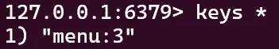

    2. 존재하지 않는 매장 `storeId=333`에서 `menuId=3` 조회 시도

       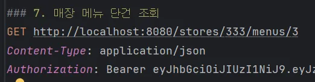

    3. 조회가 성공해버림(오동작)

       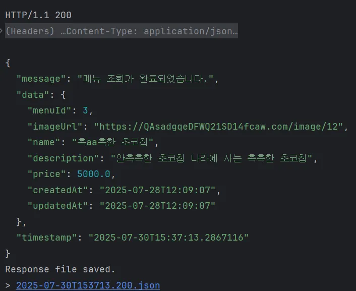


- **원인 분석**:
    - **캐시 키가 `menuId` 단일 값**만 포함하도록 설계됨
    - 서로 다른 매장이라도 `menuId`가 같으면 **같은 캐시 엔트리**를 참조 → 매장 검증 실패


- **해결**:
    - 캐시 키 구조 변경
        - 기존: `menu:{menuId}`
        - 변경: `menu:{storeId}:{menuId}`

          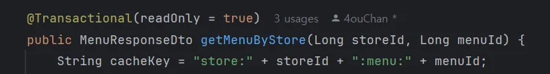


- **결과**:
    - 캐시 키에 `storeId`를 포함시켜 **매장 단위 검증**이 가능해짐
    - 잘못된 매장에서 같은 `menuId` 요청 시 **캐시 재사용이 차단**되어, 데이터 정합성 확보

---

### 🔍 주문 내역 조회 시 N+1 문제 발생 ###

- **문제 상황**:
    - 주문 페이징 조회 시 주문 수 만큼 추가 쿼리 발생 (N+1 문제)
    - 주문 단일 조회 시 주문 아이템 수 만큼 추가 쿼리 발생 (N+1 문제)


- **원인 분석**:
    - 페이징 조회: store 정보를 주문마다 별도 조회
    - 단일 조회: orderItems와 menu를 fetch join하지 않아 별도 쿼리 발생


- **해결**:
    - 페이징 조회
        - QueryDSL에 .join(order.store).fetchJoin() 추가 → 주문과 가게 정보를 한 번에 조회
    - 단일 조회
        - QueryDSL에 아래 내용을 추가:
          ```java
          .join(order.store).fetchJoin() // 주문과 가게 정보를 한 번에 조회
          .leftJoin(order.orderItems, orderItem).fetchJoin() // 주문과 주문아이템을 한 번에 조회
          .leftJoin(orderItem.menu).fetchJoin() // 주문아이템과 메뉴를 한 번에 조회
          ```         

---

### 🐳 Grafana & Prometheus / Docker-compose 연동 오류 ###

- **문제 상황**:
    - Docker Compose에서 `prom/mysqld-exporter`를 환경변수 `DATA_SOURCE_NAME` 방식으로 설정했으나, **Prometheus에서 타겟이 인식되지 않음(수집 실패)**
    ```
  mysqld_exporter:
    image: prom/mysqld-exporter
    # ...
    environment:
      # mysql 서비스 이름과 MySQL 기본 포트 3306 사용
      - DATA_SOURCE_NAME=exporter:YOUR_PASSWORD@(mysql:3306)/   # ← 문제 발생
    depends_on:
      - mysql
  ```

- **원인 분석**:
    - **핵심 원인**: 컨테이너에서 `DATA_SOURCE_NAME` 값이 **정상적으로 주입되지 않아**, Exporter가 MySQL 접속 정보를 인식하지 못함
    - 그 결과, `Exporter`가 메트릭을 노출하지 못해 **Prometheus가 타겟을 잡지 못함**


- **해결**:
    - **환경변수 주입을 사용하지 않고**, 컨테이너 시작 시 **명령줄 인자(플래그)로 직접 값 주입**하도록 변경
  ```yaml
    mysqld_exporter:
      image: prom/mysqld-exporter
      container_name: mysqld_exporter
      ports:
        - "9104:9104"
      depends_on:
        - mysql
      command:
        - "--mysqld.username=${MYSQL_USERNAME}:${MYSQL_PASSWORD}"
        - "--mysqld.address=mysql:${MYSQL_PORT}"
      networks:
        - monitoring
    ```
- **결과**:
    - **Prometheus**: Targets 페이지에서 `mysqld_exporter` 상태가 **UP**으로 표시
    - **Exporter 엔드포인트**: 브라우저/CLI로 `http://localhost:9104/metrics` 접속 시 메트릭 응답 확인
    - **컨테이너 상태/로그**: `docker compose ps mysqld_exporter`, `docker compose logs -f mysqld_exporter`에서 정상 기동 확인

---

### 🔐 웹소켓 연결 후 인증 ###

- **문제 상황**:
    - 기존의 인증 과정은 `jwtFilter`를 통해 진행됐다.
    - 그러나 웹소켓으로 업그레이드한 후부터는 인증 과정이 거쳐지지 않았다.


- **원인 분석**:
    - `JwtFilter`가 상속받은 `OncePerRequestFilter`는 **Http 요청에서만 작동**하기 때문에 다른 프로토콜인 **웹소켓으로 업그레이드 하면 작동하지 않는다.**
    - 따라서 `JwtFilter`를 통한 인증과정을 거칠 수 없다.


- **해결**:
    - `Command(Connect, Subscribe, Send, Disconnect)`를 포함한 **STOMP 프레임**을 클라이언트가 전송하면 중간에서 `ChannelInterceptor`가 가로챈다.
    - 용도에 맞게 각 명령어 별로 인증 과정을 작성하면 그 코드에 따라 검사한 후 **인증되었을 경우 메세지를 전송**할 수 있게 된다.


- **결과**:
    - 테스트 시 토큰을 포함하지 않으면 **CONNECT 자체가 불가능**했다. 또한 **토큰이 만료된 경우**에도 에러가 발생했다. 로그인을 통해 토큰을 발급받고 **유효한 토큰을 포함**하여 테스트를 했을
      때 정상적으로
      `CONNECT`가 되었고 **채팅 기능도 정상적으로 작동**한 것을 확인할 수 있었다.

---

### 🔀 다른 매장 메뉴 섞임 & 중복 아이템 병합 실패 ###

- **문제 상황**:
    - 장바구니에 서로 다른 매장 메뉴가 섞여 **배달팁/최소주문금액 계산**이 깨짐
    - 동일 메뉴가 중복행으로 쌓여 총액이 비정상


- **원인 분석**:
    - `storeId` 제약 미흡 → **추가/수정 시 검증 누락**
    - `(cart_id, menu_id)` **UNIQUE 제약 부재**로 `upsert` 실패


- **해결**:
    - **단일 매장 규칙**: 첫 아이템의 `storeId` 고정, 다른 매장 추가 시 교체/추가취소 정책
    - **중복 병합(upsert)**: 서비스 레벨 `find → ifPresent(quantity++) else insert`
    - **스키마 제약**: `(cart_id, menu_id) UNIQUE`로 데이터 일관성 보장


- **결과**:
    - 결제 단계 오류 제거, CS 감소
    - 데이터 정합성/가독성 향상, 유지보수 용이

---

## 🚀 성능 개선

### 🏪 매장 검색 기능 성능 개선 ###

- **기능**:
    - 기존 매장 검색 기능의 경우 Like 쿼리를 이용한 방식으로 검색 기능이 작동


- **문제 정의**:
    - **Like 쿼리를 이용한 방식**으로 검색 기능이 작동하다보니 `Full Scan Table` 문제가 발생하여, 매장 수가 증가함에따라 성능이 저하될 우려


- **해결**:
    - `Full Text Index` vs `Elasticsearch` 도입 검토
    - `Full Text Index`로 성능 테스트 진행 중, **부분 검색 미지원** 문제 발견
    - 최종적으로 **Elasticsearch 도입**


- **성능 테스트**
    - **테스트 도구**: `Locust`
    - **시나리오**
        - 임의 매장 **30,000개 생성** (`맛집_1 ~ 맛집_9999 * 3`)
        - **최대 동시 접속 사용자 1,000명**
        - 초당 **100명씩 증가**
        - 검색 유연성 검증을 위해 `'맛'`, `'집'` 키워드로도 요청

#### 📉 도입 전 (LIKE 쿼리 기반)

<details>
  <summary>상세 테스트 결과</summary>
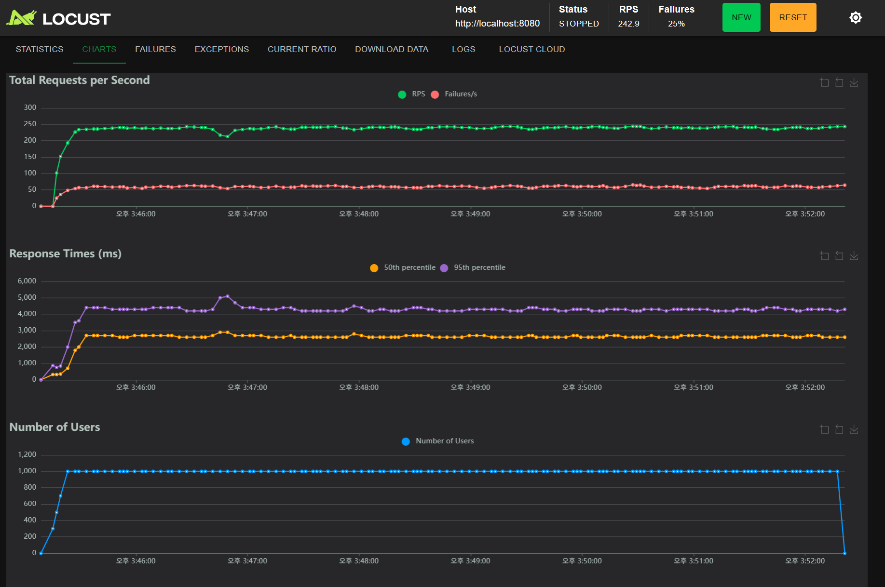
</details>

| URL (검색 키워드)                        | # Requests | # Fails | Median (ms) | 95%ile (ms) | 99%ile (ms) | Avg (ms) | Min | Max   | Avg Size (B) | RPS   | Failures/s |
          |-------------------------------------|------------|---------|-------------|-------------|-------------|----------|-----|-------|--------------|-------|------------|
| `/stores/search?keyword=맛`          | 25,350     | 0       | 2600        | 4300        | 5900        | 2655.31  | 34  | 17029 | 3514.89      | 60.3  | 0          |
| `/stores/search?keyword=맛집`         | 25,249     | 0       | 2600        | 4300        | 5900        | 2664.77  | 34  | 14819 | 3514.89      | 60.3  | 0          |
| `/stores/search?keyword=존재하지 않는 매장` | 25,292     | 25,292  | 2600        | 4300        | 5900        | 2636.52  | 21  | 11473 | 97.89        | 64.5  | 64.5       |
| `/stores/search?keyword=집`          | 25,341     | 0       | 2600        | 4300        | 5800        | 2643.49  | 31  | 12314 | 3514.89      | 57.8  | 0          |
| **Aggregated**                      | 101,232    | 25,292  | 2600        | 4300        | 5900        | 2650.02  | 21  | 17029 | 2661.18      | 242.9 | 64.5       |

#### 🚀 도입 후 (Elasticsearch 기반)

<details>
  <summary>상세 테스트 결과</summary>
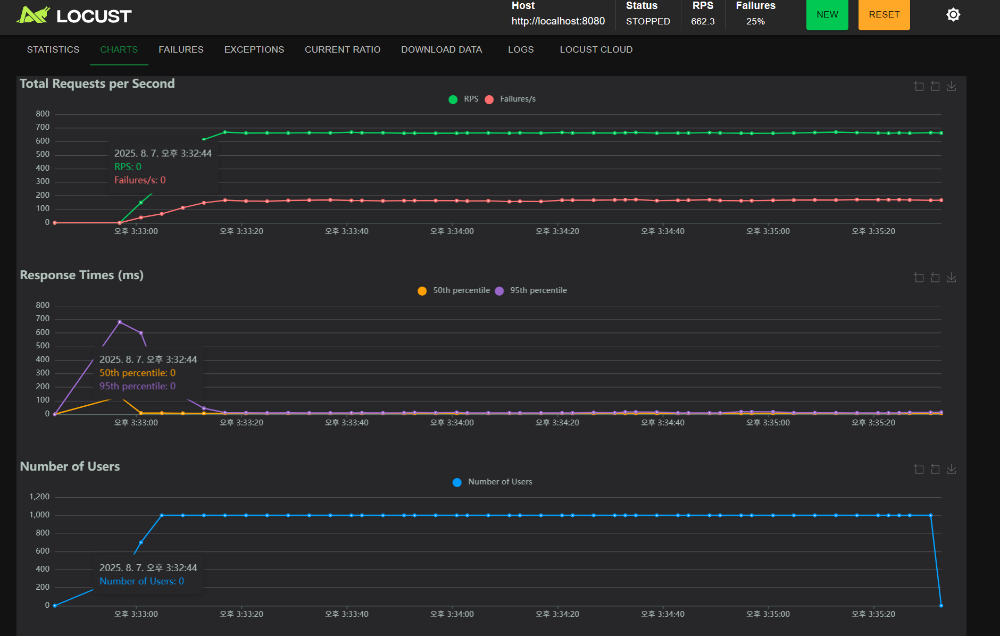
</details>

| URL (검색 키워드)                        | # Requests | # Fails | Median (ms) | 95%ile (ms) | 99%ile (ms) | Avg (ms) | Min | Max | Avg Size (B) | RPS   | Failures/s |
  |-------------------------------------|------------|---------|-------------|-------------|-------------|----------|-----|-----|--------------|-------|------------|
| `/stores/search?keyword=맛`          | 25,476     | 0       | 7           | 14          | 72          | 10.04    | 4   | 697 | 3407.89      | 166.6 | 0          |
| `/stores/search?keyword=맛집`         | 25,249     | 0       | 7           | 13          | 68          | 9.76     | 4   | 690 | 3407.89      | 166.7 | 0          |
| `/stores/search?keyword=존재하지 않는 매장` | 25,193     | 25,193  | 7           | 13          | 59          | 9.10     | 4   | 691 | 97.89        | 166.9 | 166.9      |
| `/stores/search?keyword=집`          | 25,445     | 0       | 7           | 14          | 64          | 9.72     | 4   | 692 | 3407.89      | 162.1 | 0          |
| **Aggregated**                      | 101,363    | 25,193  | 7           | 14          | 66          | 9.66     | 4   | 697 | 2585.21      | 662.3 | 166.9      |

#### 📈 성능 개선 요약 비교

| 항목         | 도입 전       | 도입 후    | 개선 폭                |
  |------------|------------|---------|---------------------|
| 평균 응답 시간   | 2650.02 ms | 9.66 ms | 약 274배 개선 (-99.64%) |
| 정상 키워드 실패율 | 0%         | 0%      | 유지                  |
| 전체 RPS     | 242.9      | 662.3   | 약 2.7배 증가           |

- **성능 개선 요약**
    - 평균 응답 시간: **약 2600ms → 10ms 수준으로 단축 (260배 이상 개선)**
    - 초당 처리량(RPS): **약 240 → 660 이상 증가 (2.7배 향상)**
    - 검색 기능: **부분 검색 지원** (`'집'` 등 키워드 일부로도 결과 반환 가능)

---

### 💬 실시간 채팅 흐름 ###

- **기능**:
    1. 웹소켓 연결 및 채팅방 입장
    2. 웹소켓 세션 저장
        - `Map<roomId, Set<WebSocketSession>>`
        - key가 입장한 채팅방의 id인 value값 Set의 요소에 세션 저장
    3. 메세지 전송
        - 메세지 발생 시 해당 채팅방에 접속 중인 사용자, 즉 저장된 세션 전체에 메세지 전달
    4. 채팅방 퇴장
        - 채팅방에서 퇴장 시 저장된 세션 삭제(멤버 탈퇴가 아니라 연결 종료)


- **문제 정의**:
    - 정상적으로 작동하지만 단일 서버에서만 동작


- **해결**:
    - **사용 기술**
        - **Kafka + STOMP**
            - **Kafka**: 서버가 여러 개인 상황에서도 동일한 채팅방의 모든 사용자가 메세지를 받을 수 있도록 도입
            - **STOMP**: 표준화된 프로토콜 제공, 구독을 통해 연결된 사용자 관리 가능
    - **웹소켓 구조**
        1. **웹소켓 연결**
            - STOMP의 `CONNECT` 시 **JWT 인증** (ChannelInterceptor 사용)
            - 엔드포인트: `/ws`
        2. **구독**
            - STOMP의 `SUBSCRIBE`로 특정 채팅방 구독
            - prefix: `/sub`
        3. **메세지 전송**
            - STOMP의 `SEND`로 서버에 메세지 전송
            - 서버의 Kafka Producer → Kafka Broker 발행
            - Kafka Consumer → Kafka Broker로부터 수신 후 STOMP Broker로 발행
            - STOMP Broker → 구독자에게 브로드캐스트
            - prefix: `/pub`


- **성능 테스트**
    - **환경**
        - 서버 2대 (`8080`, `8081` 포트)
        - 동일 채팅방을 양쪽 서버에서 구독

    - **결과**
        - 서로 다른 서버에 있는 사용자도 메세지 수신 가능
        - **Kafka**를 통한 분산 처리로 **다중 서버 환경에서도 실시간 채팅 정상 작동**

---

### 👥 유저 목록 조회 성능 개선 ###

- **기능**:
    - **유저 닉네임** or **이름**으로 검색

- **문제 정의**:
    - 회원이 많이 질 수록 닉네임이나 이름 검색 시 딜레이가 발생


- **해결**:
    1. **redis**를 이용한 캐싱
    2. **인덱싱**을 이용한 빠른 검색
    3. **redis 캐싱 + 인덱싱** 동시 적용


- **성능 테스트**
    - **테스트 도구**: `JMeter`
    - **시나리오**
        - 가상의 사용자를 **10,000명**으로 설정
        - 10,000명의 사용자가 **600초 동안 균등하게 접속**
        - 동시에 접속 시 서버의 성능 및 응답 시간 측정
        - 테스트 버전:
            - `v1` : 기존 API
            - `v2` : 이름/닉네임 인덱싱 적용
            - `v3` : Redis 캐싱 적용
            - `v4` : Redis 캐싱 + 인덱싱

#### 📈 성능 비교 요약

| 버전 | # Samples | Average (ms) | Min (ms) | Max (ms) | Std. Dev. | Error % | Throughput | Received KB/sec | Sent KB/sec | Avg. Bytes |
|----|-----------|--------------|----------|----------|-----------|---------|------------|-----------------|-------------|------------|
| v1 | 10,000    | 3            | 2        | 38       | 1.02      | 0.00%   | 16.7/sec   | 9.60            | 6.93        | 589.9      |
| v2 | 10,000    | 2            | 1        | 26       | 0.94      | 0.00%   | 16.7/sec   | 9.60            | 6.98        | 589.9      |
| v3 | 10,000    | 2            | 1        | 27       | 0.86      | 0.00%   | 16.7/sec   | 9.60            | 6.98        | 589.9      |
| v4 | 10,000    | 1            | 1        | 59       | 1.00      | 0.00%   | 16.7/sec   | 9.63            | 7.00        | 591.9      |

> `v4`의 최대 응답 시간이 다른 버전보다 높게 나타났으나, 이는 캐시 초기 적용 시나 특정 스레드에서 캐시 갱신 등의 영향으로 발생한 일시적 지연으로 판단
> <br> 대부분 요청은 **1ms 내 처리**되어 성능이 가장 우수하며, 따라서 **v4 버전을 채택**

- **성능 개선 요약**
    - 평균 응답 시간: **3ms → 1ms 수준으로 단축 (약 3배 개선)**

---

### 🧾 주문 내역 단일 조회 성능 개선 ###

- **기능**:
    - 기존 주문 내역 단일 조회 기능의 경우 `QueryDSL`을 이용한 방식으로 검색 기능이 작동


- **문제 정의**:
    - 주문 내역 단일 조회 시 매번 **DB 조회가 발생**하기 때문에 응답이 지연될 우려


- **해결**:
    - 첫 조회 시 DB에서 데이터 조회 후 **캐시에 저장**
    - 이후 동일 내역 조회 시 캐시에서 빠르게 조회


- **성능 테스트**
    - **테스트 도구**: `JMeter`
    - **시나리오**
        - 유저가 주문 내역 단일 조회를 15번 반복(각 요청 간격 500ms)

#### 📉 캐시 적용 전

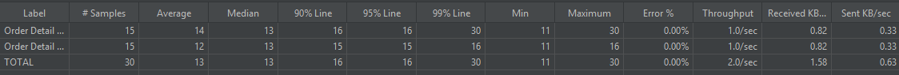

#### 🚀 도입 후 (Elasticsearch 기반)

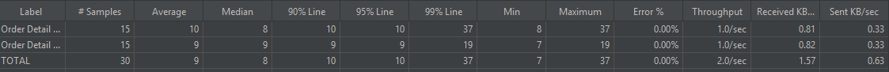

#### 📈 성능 개선 요약 비교

| 구분      | Average | Median | 90% Line | 95% Line | 99% Line | Min | Max |
|---------|---------|--------|----------|----------|----------|-----|-----|
| 캐싱 적용 전 | 13      | 13     | 16       | 16       | 30       | 11  | 30  |
| 캐싱 적용 후 | 9       | 8      | 10       | 10       | 37       | 7   | 37  |

- **성능 개선 요약**
    - 평균 응답 시간: **약 13ms → 9ms 수준으로 단축 (약 31% 감소)**
    - **Max**와 **99% Line** 값 증가 → 첫 번째 조회 시 DB 조회 + 캐시 저장으로 인한 일시적 지연

---

### 🧾 주문 내역 페이징 조회 성능 개선 ###

- **기능**:
    - 기존 주문 내역 페이징 조회 기능의 경우 `QueryDSL`을 이용한 방식으로 검색 기능이 작동


- **문제 정의**:
    - 주문 내역이 많을 경우 **조회 속도 지연 및 DB 부하** 발생 우려

    - **해결**:
        - **커버링 인덱스**를 적용
            - `order ID` 목록을 조회 후 해당 ID로 실제 데이터 조회

        - **적용 전 코드**
        ```java
          @Override
          public Page<OrderResponseDto> findOrdersByUserId(Long userId, Pageable pageable, String menuName, String storeName, LocalDate startDate, LocalDate endDate, OrderStatus status) {
                  List<OrderResponseDto> content = queryFactory.select(new QOrderResponseDto(order))
                           .from(order)
                           .join(order.store).fetchJoin() // 주문과 가게 정보를 한 번에 조회
                           .where(searchOrder(userId, menuName, storeName, startDate, endDate, status))
                           .orderBy(order.createdAt.desc())
                           .offset(pageable.getOffset())
                           .limit(pageable.getPageSize())
                           .fetch();
  
                  JPAQuery<Long> countQuery = queryFactory.select(order.count())
                           .from(order)
                           .where(searchOrder(userId, menuName, storeName, startDate, endDate, status));
  
                  return PageableExecutionUtils.getPage(content, pageable, countQuery::fetchOne);
          }
        ```
        - **적용 후 코드**

        ```java
        @Override
        public Page<OrderResponseDto> findOrdersByUserId(Long userId, Pageable pageable, String menuName, String storeName, LocalDate startDate, LocalDate endDate, OrderStatus status) {
        
                // order id 먼저 조회
                List<Long> idList = queryFactory
                        .select(order.id)
                        .from(order)
                        .where(searchOrder(userId, menuName, storeName, startDate, endDate, status))
                        .orderBy(order.createdAt.desc())
                        .offset(pageable.getOffset())
                        .limit(pageable.getPageSize())
                        .fetch();
        
                // idList가 비어있는 경우 빈 페이지 반환
                if (idList.isEmpty()) {
                    return new PageImpl<>(Collections.emptyList(), pageable, 0);
                }
        
                // id로 실제 데이터 조회
                List<OrderResponseDto> content = queryFactory.select(new QOrderResponseDto(order))
                        .from(order)
                        .join(order.store).fetchJoin() // 주문과 가게 정보를 한 번에 조회
                        .where(order.id.in(idList))
                        .orderBy(order.createdAt.desc())
                        .fetch();
        
                JPAQuery<Long> countQuery = queryFactory.select(order.count())
                        .from(order)
                        .where(searchOrder(userId, menuName, storeName, startDate, endDate, status));
        
                return PageableExecutionUtils.getPage(content, pageable, countQuery::fetchOne);
        
        }
        ```

- **성능 테스트**
    - **테스트 도구**: `JMeter`
    - **시나리오**
        - 유저 1명이 500개의 주문 내역 조회, 1초 간격 10회 반복

#### 📈 성능 비교 요약

<details>
  <summary>상세 테스트 결과</summary>
  <p><strong>인덱스 적용 전</strong></p>
  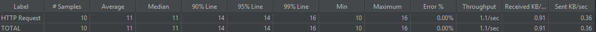
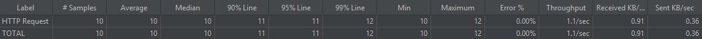
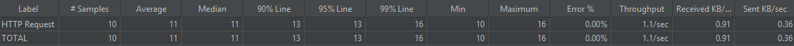
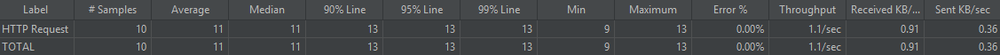

<p><strong>인덱스 적용 후</strong></p>
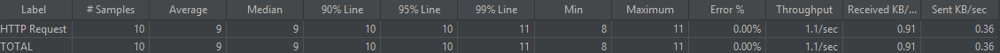
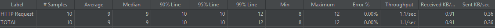
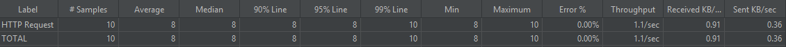
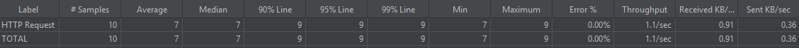
</details>

| 구분       | Average | Median | 90% Line | 95% Line | 99% Line | Min  | Max   |
|----------|---------|--------|----------|----------|----------|------|-------|
| 인덱스 적용 전 | 10.75   | 10.75  | 12.75    | 13       | 14.25    | 9.75 | 14.25 |
| 인덱스 적용 후 | 8.25    | 8.25   | 9.25     | 9.25     | 10.5     | 7.75 | 10.5  |

- **성능 개선 요약**
    - 평균 응답 시간: **약 10.75ms → 8.25ms 수준으로 단축 (약 23% 감소)**
    - 요청 9.25ms 이내 처리

---

### 🛒 공유 장바구니 단일 조회 성능 개선 ###

- **기능**:
    - 공유 장바구니(채팅방 단위) 조회 시 **불필요한 추가 쿼리(N+1)**와 서버 메모리 집계를 줄여 응답 시간을 안정화


- **문제 정의**:
    - `findBySharedCart_ChatRoom_Id(roomId)` 호출 시 `Menu/User/SharedCart`를 LAZY 로딩하며 **N+1 발생 가능**
    - 참여자 수를 Java 스트림으로 `distinct()` 계산 → 모든 항목을 메모리로 끌어와 **집계 비용 증가**


- **해결**:
    - **`Fetch Join`으로 한 번에 로딩** (N+1 제거)
    - **DB에서 참여자 수 집계** (COUNT DISTINCT)
    - **서비스 로직 교체** (메모리 집계 → DB 집계)
    - **인덱스 추가** (조회/권한검사 가속)


- **성능 테스트**
    - **테스트 도구**: `JMeter`
    - **시나리오**
        - 동일 채팅방에 `N`개 항목, 다수 사용자 참여
        - 유저 1명이 GET /chats/{roomId}/.../shared-carts/items 10~15회 반복 (요청 간격 500ms)

#### 📈 성능 비교 요약

| 구분       | Average | Median | 90% Line | 95% Line | 99% Line | Min  | Max   |
|----------|---------|--------|----------|----------|----------|------|-------|
| 인덱스 적용 전 | 11.50   | 11.50  | 13.50    | 14.25    | 16.00    | 9.75 | 16.00 |
| 인덱스 적용 후 | 8.75    | 8.50   | 9.75     | 10.25    | 12.25    | 7.50 | 12.25 |

- **성능 개선 요약**
    - `N+1` 제거 + `DB` 집계 + 인덱스로 평균 **24% 단축**
    - **95% 구간 28% 개선**

---

## 🔧 설치 및 실행 방법

<details>
<summary>클릭하여 설치 및 실행 방법을 확인하세요</summary>

1. 레포지토리 클론

- 터미널 또는 명령 프롬프트에서 다음 명령어를 실행하여 프로젝트 레포지토리를 클론합니다.

```bash
git clone https://github.com/hojunyun-dev/Eat_Together.git
```

2. Docker 실행

```bash
docker-compose up -d --build
```

- 오류 발생 시:

```bash
docker-compose down -v
```

- Docker에 프로젝트가 정상적으로 올라와 있는지 확인

</details> 

## ⚡ 사전 준비

<details>
<summary>클릭하여 사전 준비를 확인하세요</summary>

- JDK 17 버전을 준비해주세요.
- Docker를 설치해주세요 ( 최신버전으로 준비해주세요 )
- 환경 변수 설정
    - backend 디렉토리로 이동하여 .env.example 파일을 참고해 .env 파일을 생성하고 필요한 환경 변수들을 설정합니다.
    - cd backend

```
.env 파일 내용 예시:
# Google
GOOGLE_OAUTH_CLIENT_ID = { Google_CLIENT_ID }
GOOGLE_OAUTH_CLIENT_SECRET = { Google_SECRET_KEY } 

# Kakao
KAKAO_OAUTH_CLIENT_ID = { Kakao_CLIENT_ID }
KAKAO_OAUTH_CLIENT_SECRET = { Kakao_SECRET_KEY } 

# naver
NAVER_OAUTH_CLIENT_ID = { Naver_CLIENT_ID }
NAVER_OAUTH_CLIENT_SECRET = { Naver_SECRET_KEY } 

# Mysql
MYSQL_PORT = { MYSQL_PORT }
MYSQL_USERNAME = { DB_USERNAME }
MYSQL_PASSWORD = { DB_PASSWORD }
MYSQL_DBNAME = { DBNAME }

# Redis
REDIS_PORT = { REDIS_PORT }

# 이 부분을 각자 설정에 맞게 설정해주세요
```

</details> 

### 🤝 기여 방법

- 이 프로젝트에 대한 여러분의 기여를 환영합니다! 프로젝트를 함께 발전시키기 위한 가이드라인을 따릅니다.

### 🌳 기여 절차

- 이슈 생성: 새로운 기능 제안, 버그 리포트, 개선 사항 등에 대해 먼저 이슈를 생성하여 논의합니다.
- 포크 (Fork): 본 레포지토리를 개인 GitHub 계정으로 포크합니다.
- 클론 (Clone): 포크한 레포지토리를 로컬 환경으로 클론합니다.   
  `git clone https://github.com/hojunyun-dev/Eat_Together.git`

---

> - 브랜치 생성: 작업할 내용에 맞는 새 브랜치를 생성합니다.
>- 새로운 기능: git checkout -b feature/OOO-기능명
>- 코드 작성 및 테스트: 해당 브랜치에서 코드를 작성하고 충분한 테스트를 진행합니다.
>- 커밋 (Commit): 커밋 컨벤션에 따라 명확한 커밋 메시지를 작성합니다. `git commit -m "feat: OOO 기능 추가"`
> - 푸시 (Push): 변경사항을 본인의 원격 저장소에 푸시합니다. `git push origin feature/OOO-기능명`
> - 풀 리퀘스트 (Pull Request) 생성: 본 레포지토리의 main 브랜치로 풀 리퀘스트를 생성합니다. 변경 사항에 대한 상세한 설명을 포함해주세요.

---

## 🎨 코드 스타일 및 컨벤션

- 커밋 메시지: Conventional Commits 규격을 따릅니다. (예: feat: add user authentication, fix: resolve login bug)
- 브랜치 전략: main 브랜치는 항상 안정적인 버전을 유지하며, 개발은 피처 브랜치에서 진행됩니다.

## 🤝 밥사조 Project Members

<div align="center">
  <table>
    <tbody>
      <tr>
        <td align="center" style="padding: 20px;">
          
          <div style="margin-top: 10px; font-size: 14px; line-height: 1.2;">
            <b>팀장</b><br />
            <a href="https://github.com/hojunyun-dev" style="font-size: 16px;">윤호준</a>
            <div style="margin-top: 5px; font-size: 14px;">
              라이더<br />알림<br />CI/CD<br />
            </div>
          </div>
        </td>
        <td align="center" style="padding: 20px;">
          
          <div style="margin-top: 10px; font-size: 14px; line-height: 1.2;">
            <b>부팀장</b><br />
            <a href="https://github.com/Ddiy0ng" style="font-size: 16px;">박소희</a>
            <div style="margin-top: 5px; font-size: 14px;">
              채팅<br />
            </div>
          </div>
        </td>
        <td align="center" style="padding: 20px;">
          
          <div style="margin-top: 10px; font-size: 14px; line-height: 1.2;">
            <b>팀원</b><br />
            <a href="https://github.com/syumz" style="font-size: 16px;">임서연</a>
            <div style="margin-top: 5px; font-size: 14px;">
              주문<br />결제<br />
            </div>
          </div>
        </td>
        <td align="center" style="padding: 20px;">
          
          <div style="margin-top: 10px; font-size: 14px; line-height: 1.2;">
            <b>팀원</b><br />
            <a href="https://github.com/Gyum1" style="font-size: 16px;">이태겸</a>
            <div style="margin-top: 5px; font-size: 14px;">
              장바구니<br />
            </div>
          </div>
        </td>
        <td align="center" style="padding: 20px;">
          
          <div style="margin-top: 10px; font-size: 14px; line-height: 1.2;">
            <b>팀원</b><br />
            <a href="https://github.com/4ouChan" style="font-size: 16px;">김현찬</a>
            <div style="margin-top: 5px; font-size: 14px;">
              매장<br />메뉴<br />
            </div>
          </div>
        </td>
        <td align="center" style="padding: 20px;">
          
          <div style="margin-top: 10px; font-size: 14px; line-height: 1.2;">
            <b>팀원</b><br />
            <a href="https://github.com/KimDohwan24" style="font-size: 16px;">김도환</a>
            <div style="margin-top: 5px; font-size: 14px;">
              유저<br />모니터링<br />
            </div>
          </div>
        </td>
      </tr>
    </tbody>
  </table>
</div>

## [📚 밥사조 Team Notion 보러가기](https://www.notion.so/teamsparta/2322dc3ef5148046a7cdc53504fdd459)

